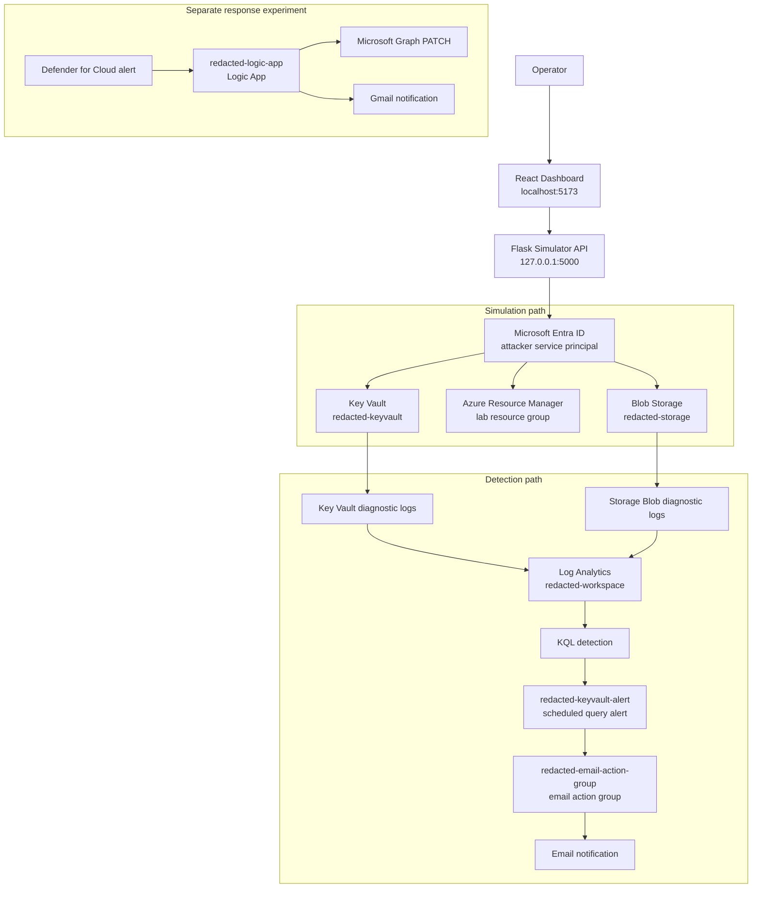
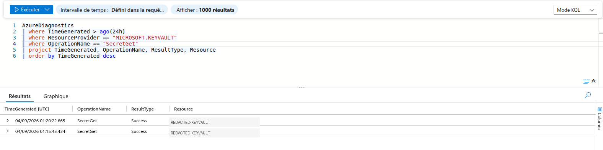
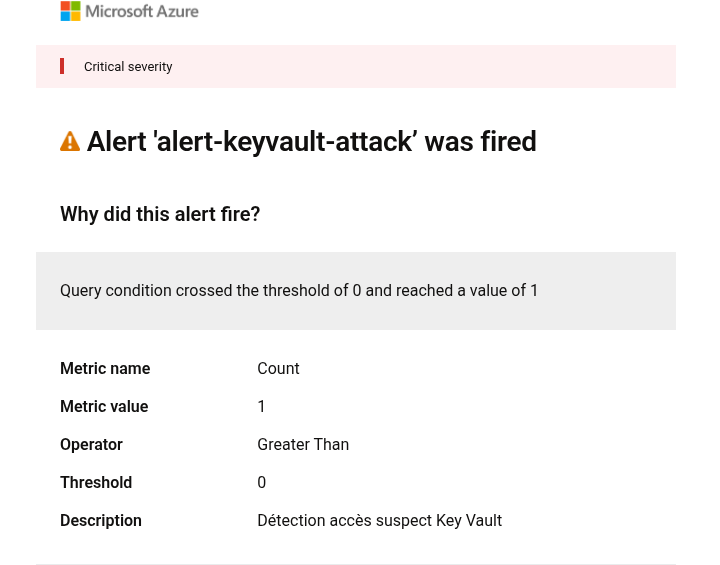
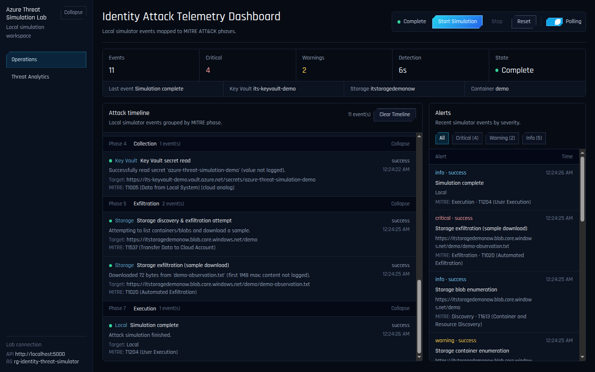
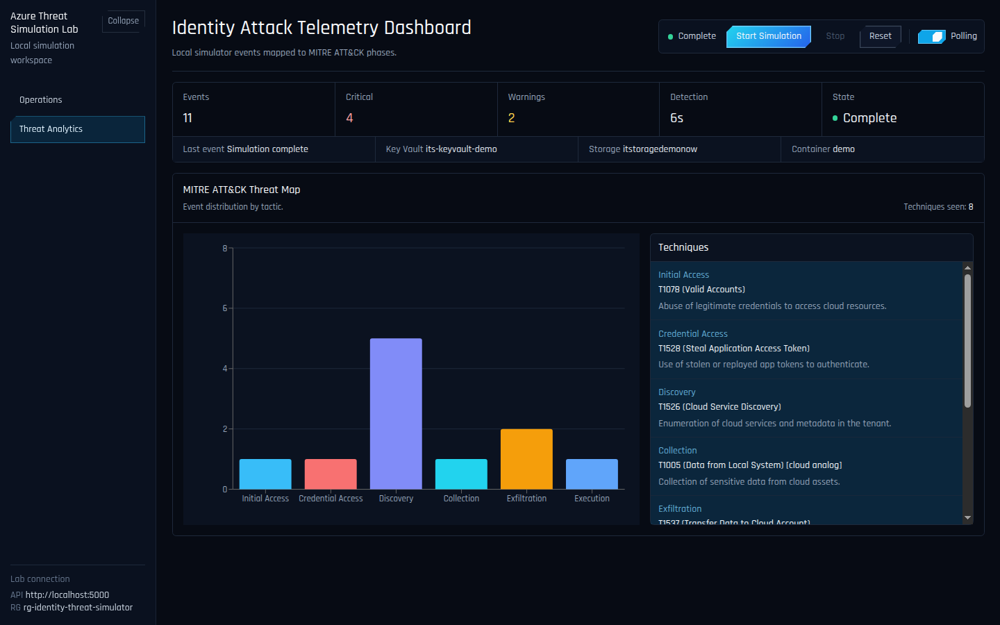
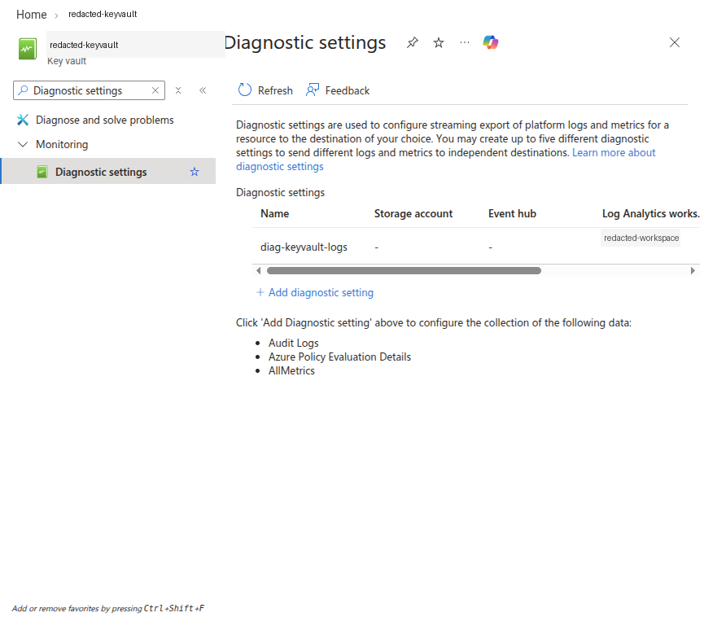
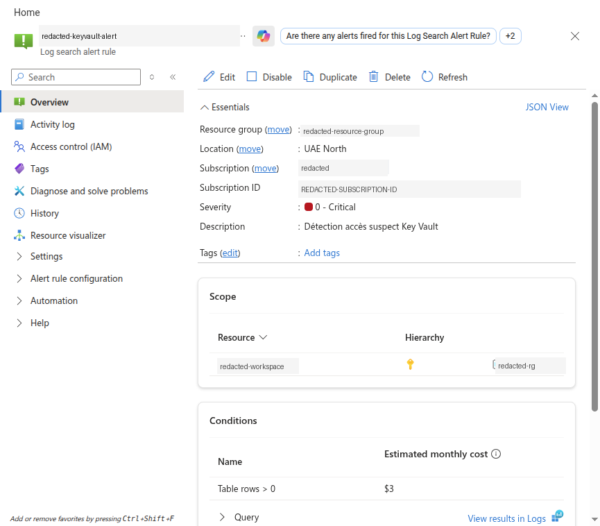
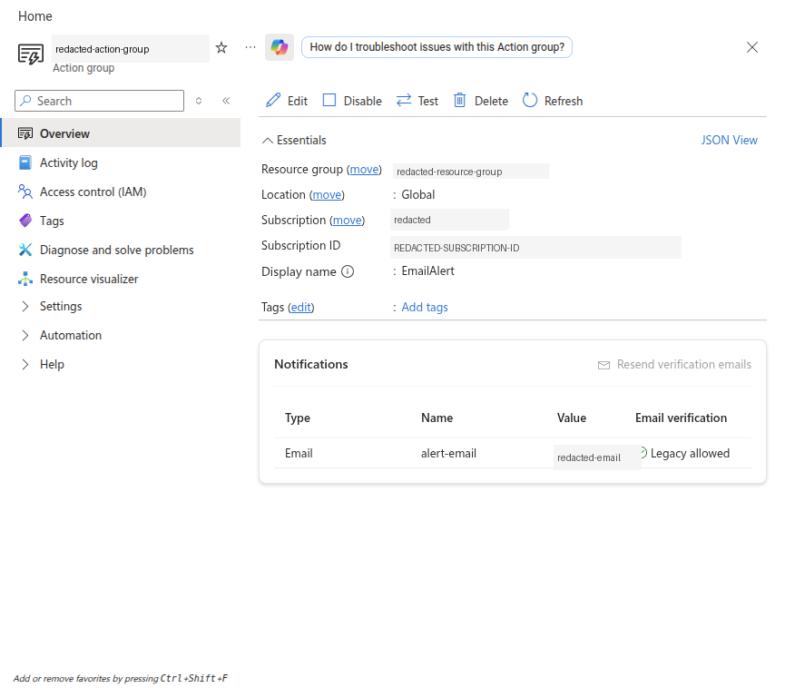
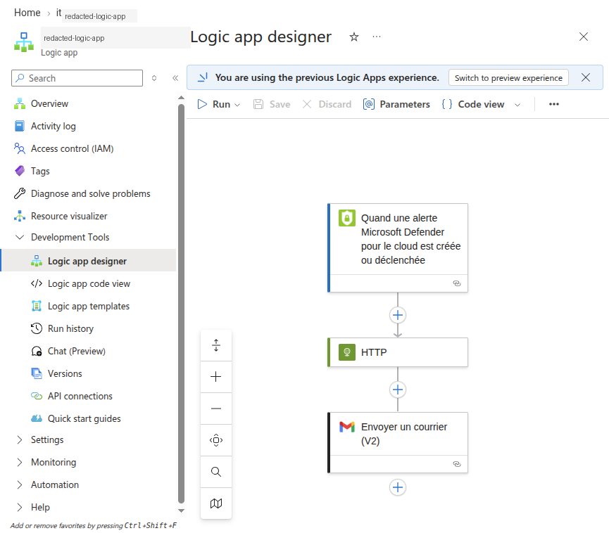

<h1 align="center">Azure Threat Simulation Lab</h1>

<p align="center">
  Controlled Azure identity attack simulation with local telemetry, KQL detection, and alerting.
</p>

<p align="center">
  <a href="https://github.com/Abdelkrim7Be/azure-identity-threat-simulator/actions/workflows/ci.yml">
    
  </a>
</p>

<p align="center">
  
  
  
  
  
  
  
  
  
</p>

Azure Threat Simulation Lab is a small cloud-security proof of concept that runs controlled identity-driven activity against dedicated Azure lab resources, displays the simulated attack sequence in a local dashboard, and verifies the resulting Azure telemetry with Log Analytics, KQL, and an Azure scheduled query alert.

It is an educational lab, not a production attack platform, SOC product, or red-team framework.

## Overview

The project connects a local React dashboard, a local Flask simulator, a dedicated Microsoft Entra service principal, and a small set of Azure resources. The simulator authenticates as the lab service principal, performs controlled read-only operations against Key Vault, Azure Resource Manager, and Blob Storage, and records the local simulation timeline for the dashboard.

The defensive side is handled by Azure-native telemetry. Key Vault and Storage diagnostic settings send resource logs to Log Analytics, where KQL can be used to detect the operations generated by the simulator. A scheduled query rule watches for Key Vault `SecretGet` activity and sends the alert to an email action group.

The key distinction is important: the dashboard shows local simulator events; Log Analytics contains Azure-native telemetry produced by real Azure operations.

## Why I Built This

This project started as a small proof of concept while I was preparing for a cloud/security-focused internship interview. Azure security was relatively new to me, so I used a project-based learning approach instead of relying only on documentation and theoretical interview preparation.

I wanted to understand how the pieces fit together in practice: Microsoft Entra identities, service principals, OAuth2 client credentials, Azure RBAC, data-plane versus management-plane permissions, Key Vault, Storage, Azure SDK authentication, diagnostic settings, Log Analytics, KQL detection, alerting, and the early shape of automated response.

The result is intentionally small. Its value is that it uses real Azure resources, real permissions, real telemetry, and honest limits.

## Architecture



The Logic App is separate from the KQL alerting path. The verified path is Log Analytics -> scheduled query alert -> email action group. The Logic App is documented as a separate automated-response experiment.

## Azure Resources

| Resource | Azure service | Purpose | Role in lab |
|---|---|---|---|
| `redacted-resource-group` | Resource group | Dedicated lab boundary | Contains the POC resources |
| `redacted-keyvault` | Key Vault | Demo secret target | Generates `SecretList` and `SecretGet` telemetry |
| `redacted-storage` | Storage account | Demo blob target | Generates blob listing and download telemetry |
| `demo` | Blob container | Harmless test data | Holds tiny synthetic files for the storage simulation |
| `redacted-workspace` | Log Analytics workspace | Detection workspace | Receives Key Vault and Storage diagnostic logs |
| `redacted-keyvault-alert` | Scheduled query rule | Key Vault detection | Fires on `SecretGet` activity |
| `redacted-email-action-group` | Action group | Alert notification | Email receiver for the scheduled query alert |
| `redacted-logic-app` | Logic App | Response experiment | Triggered by Defender for Cloud, separate from the KQL alert |
| `SecurityInsights(redacted-workspace)` | Microsoft Sentinel solution | Sentinel enablement | Enables security operations features on the workspace |
| `gmail`, `ascalert` | API connections | Logic App connectors | Used by the response experiment |

## How the Lab Works

1. The operator starts the local Flask API and React dashboard.
2. The dashboard calls the Flask API over localhost.
3. The simulator authenticates with Microsoft Entra ID using a dedicated service principal.
4. Azure RBAC determines which Key Vault, ARM, and Storage operations are allowed.
5. The simulator emits local events for the dashboard timeline and alert panel.
6. Azure resources emit diagnostic logs into Log Analytics.
7. KQL queries detect the generated Azure operations.
8. The scheduled query rule fires on `SecretGet` telemetry and invokes the email action group.

## Detection in Action

The verified end-to-end detection path is:

`Attack simulation` -> `suspicious Azure activity` -> `telemetry/log collection` -> `detection rule triggered` -> `Azure Monitor alert` -> `email notification`



Log Analytics returning Key Vault `SecretGet` records generated by the controlled simulator run, connecting the local simulation to Azure diagnostic telemetry and KQL detection.



Azure Monitor alert triggered after the simulator generated suspicious Key Vault access activity.

## Attack Simulation

The simulator performs controlled, non-destructive actions against lab resources only.

| Phase | Area | Operation | MITRE mapping |
|---|---|---|---|
| 1 | Initial access | Starts a simulated use of compromised app credentials | `T1078` Valid Accounts |
| 2 | Credential access | Authenticates as the attacker service principal | `T1528` Steal Application Access Token |
| 3 | Discovery | Lists Key Vault secret metadata | Discovery |
| 4 | Collection | Reads one configured harmless demo secret | Credential/secret access |
| 5 | Discovery | Enumerates resources in the lab resource group through ARM | `T1526` Cloud Service Discovery |
| 6 | Discovery | Lists blob containers and blobs | Cloud Storage Discovery |
| 7 | Exfiltration | Downloads a small sample from one harmless demo blob | `T1020` Automated Exfiltration |

The simulator does not log secret values or blob contents.

## Identity And RBAC

The simulator uses Azure SDK `ClientSecretCredential`, which implements the OAuth2 client-credentials flow for a Microsoft Entra service principal. The client ID, tenant ID, and client secret are loaded from local environment variables.

Authentication and authorization are separate:

- authentication proves the service principal can obtain an Azure token;
- authorization is enforced by Azure RBAC and decides what that token can actually do.

The working lab uses these least-privilege roles for the attacker identity:

| Principal | Role | Scope | Why |
|---|---|---|---|
| Attacker service principal | Reader | Lab resource group | Required for ARM resource-group enumeration |
| Attacker service principal | Key Vault Reader | Lab Key Vault | Existing metadata read role |
| Attacker service principal | Key Vault Secrets User | Lab Key Vault | Required for secret list/get data-plane operations |
| Attacker service principal | Storage Blob Data Reader | Lab storage account | Required because the simulator lists containers and reads blobs |

No `Owner`, `Contributor`, or `User Access Administrator` role is required for the attacker service principal.

## Dashboard And Simulation View

The dashboard is a local operator view for the simulator. It provides start, stop, reset, polling, severity filters, a MITRE-grouped timeline, an alert panel, and a threat analytics view. The UI uses a larger high-contrast operator font, beveled command buttons, and a moving polling toggle so the lab can be read clearly during demos and screenshots.



Completed local simulation showing the Key Vault, ARM, and Storage steps in the MITRE-grouped timeline and recent alert queue. These are simulator events, not direct Log Analytics records.



The Threat Analytics view groups local simulator events by MITRE ATT&CK tactic and technique, with charted tactic counts and technique descriptions.

## Azure Telemetry

The Azure side is verified through diagnostic settings and Log Analytics.

| Source | Diagnostic destination | Log Analytics table | Verified operations |
|---|---|---|---|
| Key Vault | `redacted-workspace` | `AzureDiagnostics` | `SecretList`, `SecretGet` |
| Blob Storage | `redacted-workspace` | `StorageBlobLogs` | `ListContainers`, `GetBlob`, `GetBlobProperties` |

The ARM resource-group enumeration succeeds in the simulator. Export of subscription Activity Log entries to this workspace was not proven during the final pass, so this README does not claim ARM telemetry is currently available in Log Analytics.



Key Vault diagnostic settings forwarding audit logs to the Log Analytics workspace.

## Detection With KQL

The main verified detection watches for Key Vault secret reads:

```kusto
AzureDiagnostics
| where TimeGenerated > ago(2h)
| where ResourceProvider == "MICROSOFT.KEYVAULT"
| where OperationName == "SecretGet"
| project TimeGenerated, OperationName, ResultType, Resource
| order by TimeGenerated desc
```

During final verification, this query returned simulator-generated `SecretGet` events in `AzureDiagnostics`.

Additional KQL examples for Key Vault and Storage are in [`detection/kql_queries.md`](./detection/kql_queries.md).

## Detection Results

Verified evidence from the final pass:

| Evidence | Result |
|---|---|
| Simulator run | Completed Key Vault, ARM, and Storage operations |
| Key Vault telemetry | `SecretList` and `SecretGet` appeared in `AzureDiagnostics` |
| Storage telemetry | `ListContainers`, `GetBlob`, and `GetBlobProperties` appeared in `StorageBlobLogs` |
| KQL detection | The `SecretGet` query returned simulator-generated events |
| Scheduled query alert | `redacted-keyvault-alert` fired after the simulation |
| Email notification | Azure Monitor generated an alert email for `redacted-keyvault-alert` |

## Alerting

The verified alerting path is:

`Key Vault SecretGet` -> diagnostic logs -> Log Analytics -> KQL -> scheduled query alert -> email action group

Final verification showed that the scheduled query alert is enabled, evaluates every minute over a one-minute window, entered a fired state after the simulator generated Key Vault `SecretGet` telemetry, and produced an Azure Monitor alert email.



The scheduled query rule used for the Key Vault detection. Subscription identifiers are redacted.



The email action group configured for the scheduled query alert. The receiver value is redacted.

## Automated Response Experiment

The Logic App is a separate experiment for learning response automation concepts:

`Defender for Cloud alert` -> Logic App -> Microsoft Graph PATCH -> Gmail notification

It is not connected to the scheduled query rule.

Observed state during final verification:

- the Logic App is enabled;
- the trigger is a Defender for Cloud alert;
- the workflow contains an HTTP PATCH action toward Microsoft Graph and a Gmail send action;
- no successful run history was present;
- the managed identity had no Microsoft Graph app-role assignments;
- the managed identity currently has broader Azure permissions than this experiment should need.

Because fully enabling Microsoft Graph remediation can require tenant-wide admin consent and can affect real identities, this remains documented as an incomplete experiment rather than a proven automated response.



Logic App designer showing the separate Defender-triggered response experiment.

## Setup And Running The Lab

### Prerequisites

- Python 3.11+
- Node.js 20.19+
- Azure CLI
- A dedicated Azure lab resource group
- A dedicated Microsoft Entra service principal
- A Key Vault with one harmless demo secret
- A Storage account with one harmless demo container and blob
- A Log Analytics workspace
- Diagnostic settings from Key Vault and Blob service to Log Analytics

Do not point this lab at production resources.

### Configuration

Copy the placeholder file:

```bash
cp .env.example .env
```

Required environment variables:

```text
ATTACKER_CLIENT_ID=<your-attacker-service-principal-client-id>
ATTACKER_CLIENT_SECRET=<your-attacker-service-principal-secret>
ATTACKER_TENANT_ID=<your-microsoft-entra-tenant-id>
AZURE_SUBSCRIPTION_ID=<your-subscription-id>
AZURE_RESOURCE_GROUP=<your-lab-resource-group-name>
AZURE_KEYVAULT_NAME=<your-lab-keyvault-name>
AZURE_STORAGE_ACCOUNT_NAME=<your-lab-storage-account-name>
```

Optional environment variables:

```text
AZURE_KEYVAULT_SECRET_NAME=<optional-demo-secret-name>
AZURE_STORAGE_CONTAINER_NAME=<your-lab-storage-container-name>
```

`.env` is gitignored and must never be committed.

### Install

```bash
cd simulator
python3 -m venv .venv
source .venv/bin/activate
pip install -r requirements.txt

cd ../dashboard
npm install
```

### Run

Terminal 1:

```bash
cd simulator
source .venv/bin/activate
python attack_simulator.py
```

Terminal 2:

```bash
cd dashboard
npm run dev
```

Open `http://localhost:5173` and click **Start Attack**.

Local API endpoints:

- `GET /healthz`
- `GET /status`
- `GET /events`
- `POST /start-attack`
- `POST /stop-attack`
- `POST /reset`

## Detection Verification

After running the simulator, verify Key Vault telemetry:

```kusto
AzureDiagnostics
| where TimeGenerated > ago(2h)
| where ResourceProvider == "MICROSOFT.KEYVAULT"
| where OperationName in ("SecretList", "SecretGet")
| summarize EventCount=count(), Latest=max(TimeGenerated)
    by OperationName, ResultType
| order by Latest desc
```

Verify Storage telemetry:

```kusto
StorageBlobLogs
| where TimeGenerated > ago(2h)
| where OperationName in ("ListContainers", "GetBlob", "GetBlobProperties")
| summarize EventCount=count(), Latest=max(TimeGenerated)
    by OperationName, StatusCode, AuthenticationType
| order by Latest desc
```

## Tests

Backend tests mock Azure SDK clients and ARM HTTP calls. They cover configuration validation, fail-closed behavior when attacker credentials are missing, simulator start/stop/reset behavior, the mocked Key Vault/ARM/Storage path, and the configured demo-secret guard.

Run backend tests:

```bash
cd simulator
source .venv/bin/activate
python -m pytest -q
```

Build the dashboard:

```bash
cd dashboard
npm run build
```

## Security Model

- Dedicated lab resources only.
- Dedicated service principal only.
- Credentials are read from local environment variables and `.env`.
- `.env` is gitignored.
- The Flask API binds to `127.0.0.1`.
- CORS allows only local dashboard origins.
- Secret values and blob contents are not logged.
- Azure RBAC is the authorization boundary.

See [`SECURITY.md`](./SECURITY.md).

## Project Structure

```text
.
├── dashboard/          # React dashboard
├── detection/          # KQL detections
├── docs/screenshots/   # Redacted screenshots used by README
├── simulator/          # Flask API and simulator
│   └── tests/          # pytest suite with Azure calls mocked
├── .env.example        # Placeholder config only
├── SECURITY.md
└── README.md
```

## Cleanup

This lab can create billable Azure resources if reproduced in another subscription. When finished, disable or remove resources you no longer need:

- scheduled query alerts;
- action groups;
- Logic Apps and API connections;
- Log Analytics workspace retention/data ingestion;
- Key Vault and Storage demo resources;
- the dedicated service principal and role assignments.

Do not delete shared or production resources.

## Limitations

- This is an educational POC, not a production security platform.
- The simulator is local and single-user.
- Event storage is in memory.
- The Flask API has no authentication because it is bound to localhost.
- The dashboard is a simulator view, not a live Azure log viewer.
- ARM Activity Log export to Log Analytics was not proven during final verification.
- Mailbox receipt was not independently verified during automation.
- The Logic App response path is experimental and not proven end to end.
- Existing Logic App managed-identity permissions should be reviewed before any production-style use.

## What I Learned

Before building this, many of the Azure security concepts were mostly theoretical to me. The lab made the boundaries concrete.

I saw that a service principal can authenticate successfully and still fail if Azure RBAC does not authorize the requested operation. I had to separate management-plane access through ARM from data-plane access to Key Vault secrets and Storage blobs. I also saw how a small Azure action turns into telemetry, how diagnostic settings decide where that telemetry goes, how KQL turns logs into a detection, and how an alert rule turns a query result into an operational signal.

The incomplete Logic App experiment was useful for a different reason: it showed that automated response is not just wiring tools together. Identity permissions, Microsoft Graph scopes, admin consent, and blast radius matter as much as the workflow design.

## Responsible Use

Only run this lab against Azure resources you own or are explicitly authorized to test. Do not use production credentials, production tenants, or shared resources. See [`SECURITY.md`](./SECURITY.md) for the project security policy.

## License

MIT License. See [`LICENSE`](./LICENSE).
